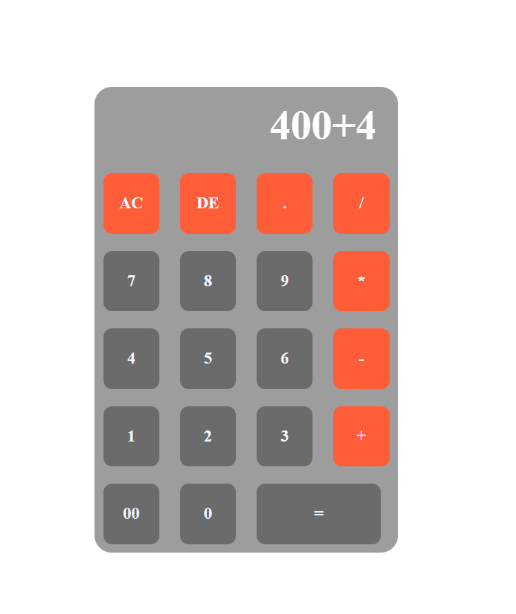

# Simple-Calculator
A simple and responsive calculator built using HTML, CSS, and JavaScript. This web-based calculator can perform basic arithmetic operations like addition, subtraction, multiplication, and division. Designed with clean UI and smooth interactions.
# Simple Calculator

A responsive and user-friendly calculator built using **HTML**, **CSS**, and **JavaScript**. This calculator performs basic arithmetic operations such as addition, subtraction, multiplication, and division.

🔗 **Live Demo**: [Click Here](https://sumitnarwade24.github.io/Simple-Calculator/)

---

## 🚀 Features

- Basic operations: Add, Subtract, Multiply, Divide
- Clean and minimal user interface
- Responsive design (works on mobile and desktop)

---

## 🛠️ Technologies Used

- HTML
- CSS
- JavaScript

---

## 💻 How to Run the Project

1. Download or clone this repository:
 git clone https://github.com/SumitNarwade24/Simple-Calculator.git

2. Open the folder and double-click on `index.html` to launch the calculator in your browser.

---

## 📸 Screenshot

---

## 🙌 Author

**Sumit Narwade**  
🔗 GitHub: [SumitNarwade24](https://github.com/SumitNarwade24)

---

## 📃 License

This project is open-source and free to use.

